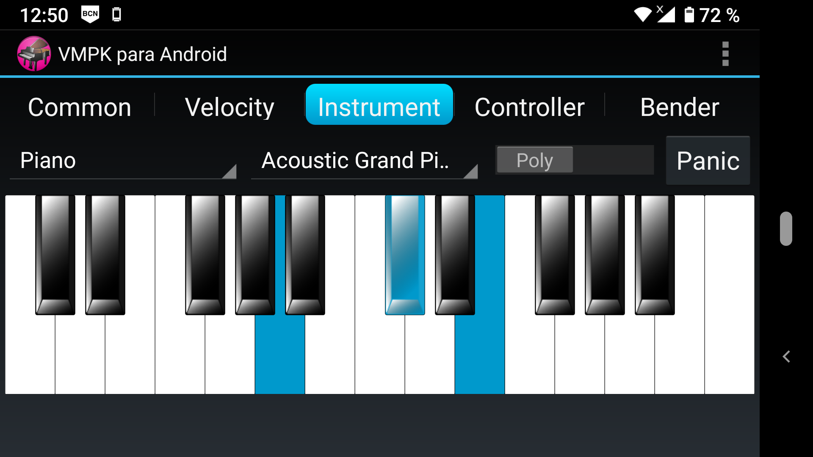

# VMPK for Android

This is the Java version of VMPK, ported to the Android operating system.

Virtual MIDI Piano Keyboard for Android is a MIDI events generator simulating a MIDI controller. It generates sound with the help of an embedded software MIDI synthesizer (Sonivox EAS) or sends MIDI events to the local network using a compatible IPMIDI protocol.

## Screenshot

## License

SPDX-License-Identifier: GPL-3.0-or-later  
Copyright © 2013–2025 Pedro López-Cabanillas.  
