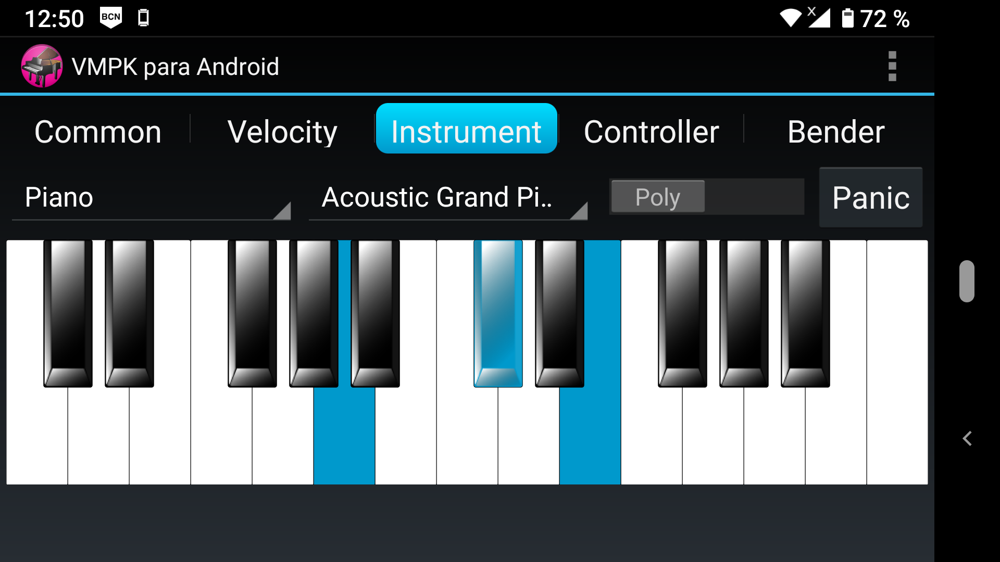

> Virtual MIDI Piano Keyboard for Android is a MIDI events generator simulating a MIDI controller. It generates sound with the help of an embedded software MIDI synthesizer (Sonivox EAS) or sends MIDI events to the local network using a compatible IPMIDI protocol.

 
 
 

This program is a MIDI Controller emulated by software. It produces MIDI
events, which can be received by other compatible devices like MIDI
Synthesizers to produce sound. The package you have installed already
includes a MIDI Synthesizer, in addition to a mechanism for transmitting
MIDI events by the network that can be received by computers connected
to your local network, using either Ethernet or Wireless interfaces.

To receive these MIDI events on a Windows PC or Mac OSX connected to the
same local network as your Android device, install in the computer the
software [ipMIDI](https://nerds.de/en/ipmidi.html) gateway. In Linux you
can use either
[multimidicast](https://llg.cubic.org/tools/multimidicast/) or
[Qmidinet](https://github.com/rncbc/qmidinet). You may need to disable
or reconfigure the Firewall in your computer to allow these programs to
work properly.

VMPK does not record songs or reproduce recordings. To record, edit and
play MIDI compositions you need a MIDI Sequencer, which is a different 
type of MIDI Software.

## Main features

In the first row of the screen you can find a bar with 5 buttons,
selecting the features shown in the row immediately below. These are the
usual controls of any MIDI controller keyboard, with some
particularities.

Some sliders can change its value using the device\'s tilt sensor
(accelerometer/gyroscope). This feature is activated by the switches
labeled \"Gyro\".

The piano keyboard initially shows 2 octaves, but there is an option in
the Settings page to select any number of keys. By selecting a larger
number, the size of the keys becomes smaller enough to fit the whole
keyboard onto the screen.

You can press simultaneously as much keys as the number of your device
simultaneous touch points.

The program\'s menu is available where you usually find it on the
Android apps. The \"Show note names\" option activates tags over the
piano keys displaying the names of the notes and their octave numbers.
The \"Settings\" menu option opens a configuration page where you can
change several options. The \"Full screen\" option hides all controls
and text except the piano keyboard, so you can focus in your music
without distractions.

The main volume of the synthesizer can be changed using the standard
operating system functions.

*It is recommended to use headphones to avoid disturbing others nearby*.

## Settings

### Piano Settings

-   Number of Piano Keys: any value between 12 and 49. By default, the
    keyboard displays 25 keys.

-   First Key: any natural note between C and B. By default, the
    starting note is C.

-   Key Pressed Color: you may choose any color among many ones
    available.

-   MIDI Output: by default, VMPK sends MIDI events to the internal
    synthesizer, but it can also send MIDI events to external devices,
    using your device\'s WiFi radio.

-   Double Keyboard in Full Screen: when the Full Screen mode is
    activated there can be two keyboards. The lower one is exactly like
    the upper (same number of keys, same starting note) but plays the
    lower octaves.

### Program Settings

-   Language: you can choose from Spanish and English translations of
    the program texts.

-   Theme: you can choose from a dark and a light theme. The dark theme
    uses less power than the light one, enabling longer battery life.

### Internal MIDI Synthesizer Settings

-   Reverb: There are four available presets for reverberation, and the
    option to switch it off entirely.

-   Chorus: There are four available presets for chorus, and the option
    to switch it off entirely.

### Network-UDP Multicast (IPMIDI)

You should use these values unchanged, unless you configure the software
in your computers in the same way as well.

-   Port number: by default, ipMIDI uses the port number 21928

-   Multicast address: by default the ipMIDI address is 255.0.0.37

## Screenshot

## License

SPDX-License-Identifier: GPL-3.0-or-later  
Copyright © 2013–2025 Pedro López-Cabanillas.  
